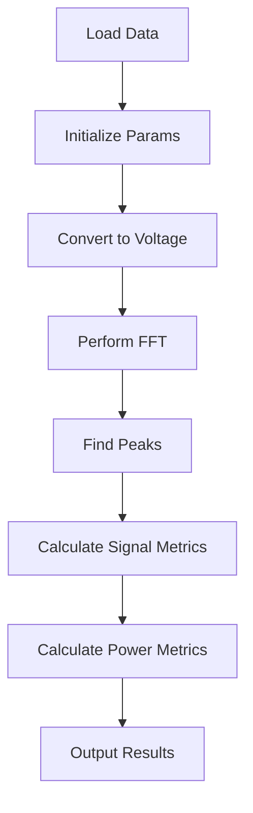

# NI cRIO Backpane Signal Analyzer

This project is a signal analyzer designed for signals generated by National Instruments cSeries I/O modules for the cRIO chassis. The Python program estimates several key parameters, including:

- Signal amplitude
- FFT bin length
- Frequency of the peak
- Amplitude of the frequency peak
- Effective Number of Bits (ENOB)

## Requirements

The code requires a textual input file to function. In this case, the input file is generated directly from a LabVIEW VI for data acquisition of the cRIO I/O chassis. 

Additionally, a signal acquisition method has been tested using custom NI-cRIO I/O modules equipped with Digital-to-Analog Converters (DACs). The analog signal from the I/O module DAC has been acquired using MDSplus, and then analyzed with this Python script.

For more information on MDSplus, visit: [MDSplus Documentation](http://www.mdsplus.org/index.php/Documentation:Users:MDSobjects:Python)

## Process Workflow

## Usage

To use the signal analyzer, ensure you have the required dependencies installed and provide the appropriate input file. The program will process the data and output the estimated parameters.

## License

This project is licensed under the MIT License - see the [LICENSE](LICENSE) file for details.
